## Задание 1
На основе диаграммы написать классы и конструкторы, без реализации методов.

## Задание 3
С помощью UML диаграммы описать классы приложения.

___

___
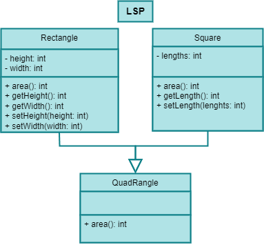
___
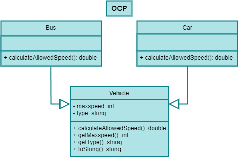
___
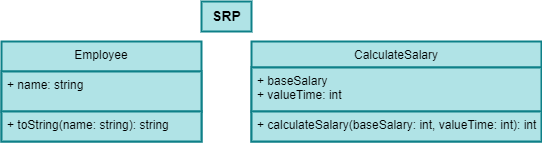
## Задание 4
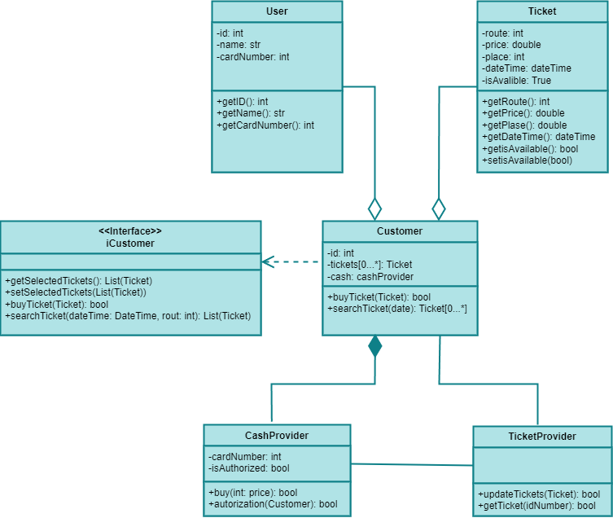

## Задание 5
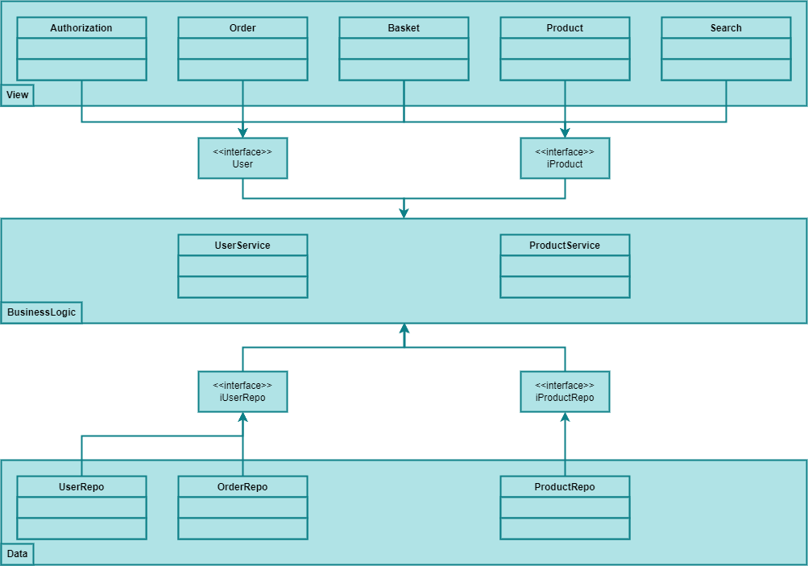

## Задание 6
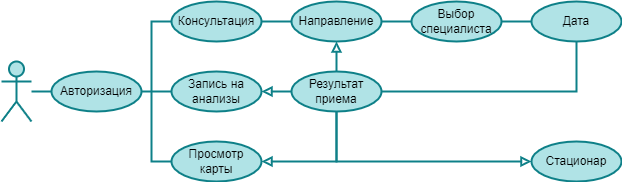
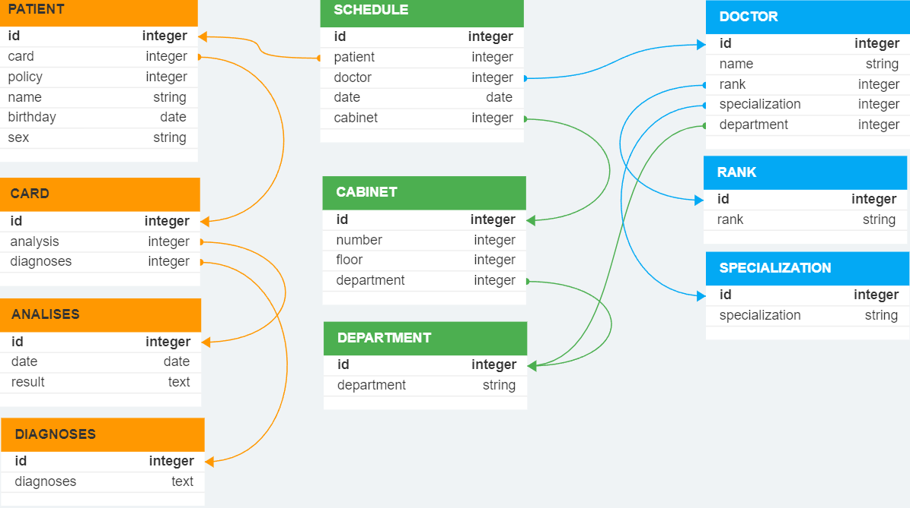

## Задание 7
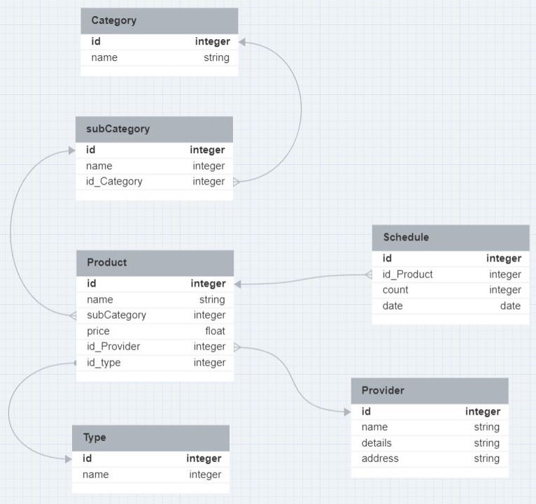
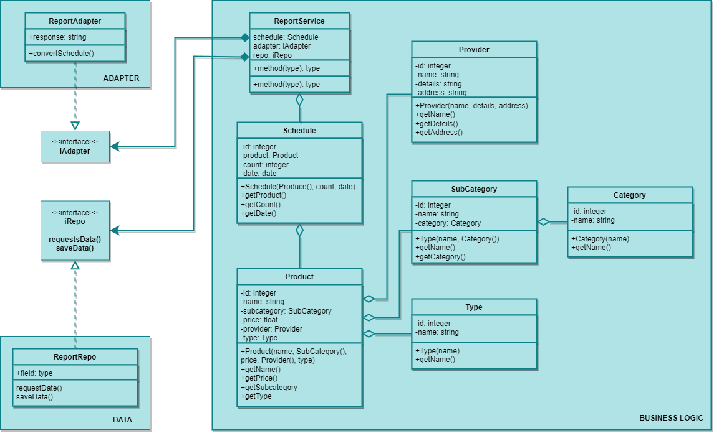
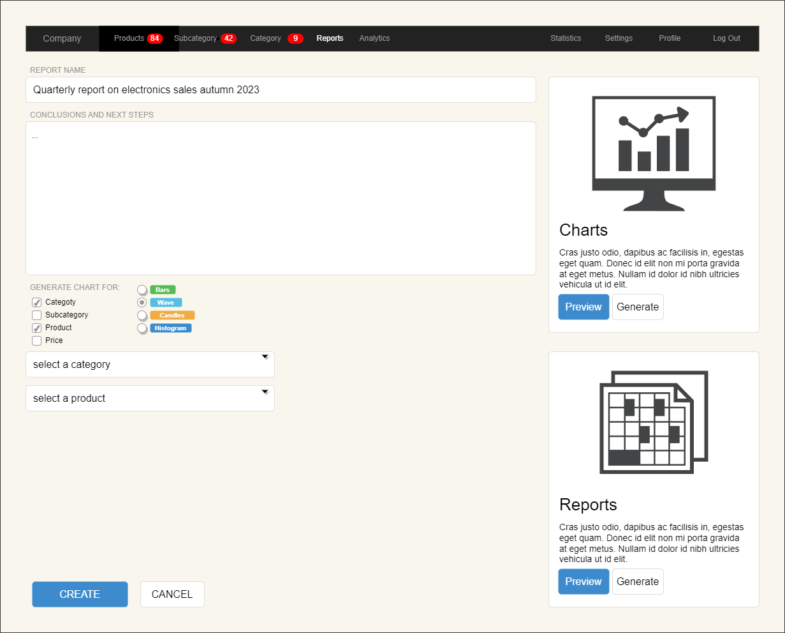

## Задание 8
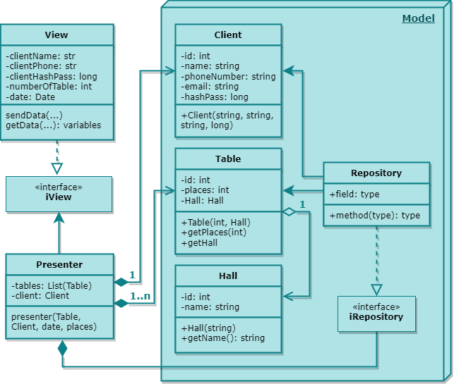

## Задание 10
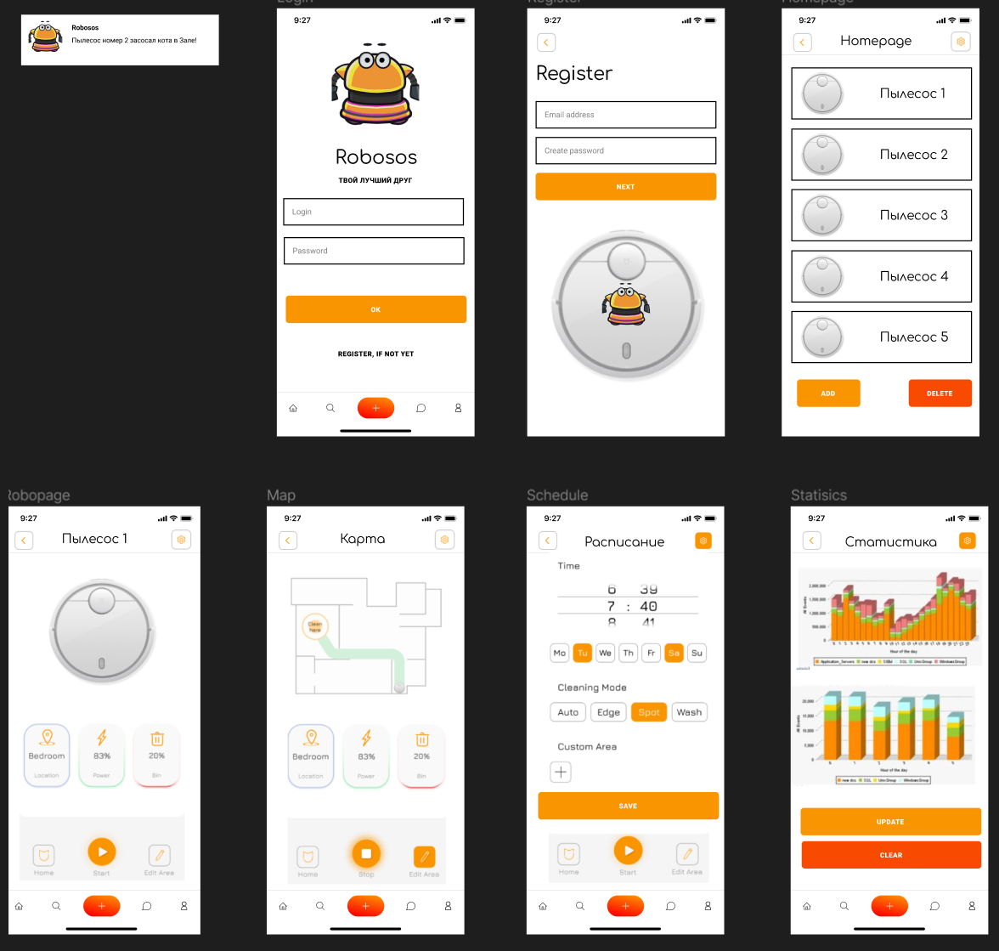
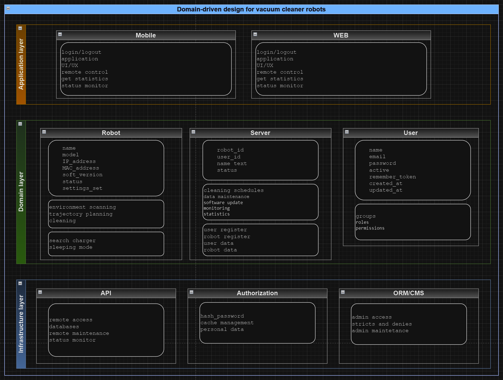
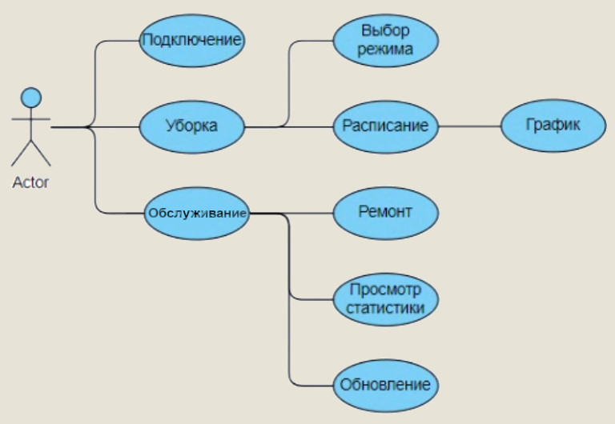

[//]: # (![swagger]&#40;hw10/d/swagger.PNG&#41;)
[//]: # (![swagger2]&#40;hw10/d/swagger2.PNG&#41;)

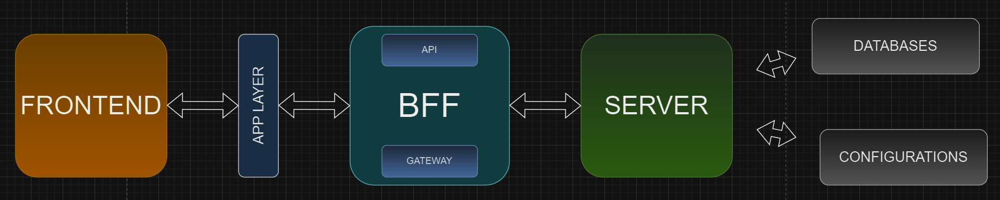
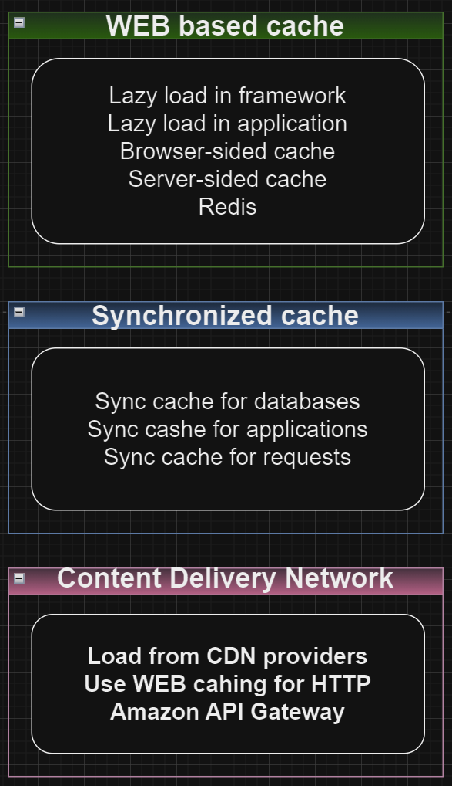
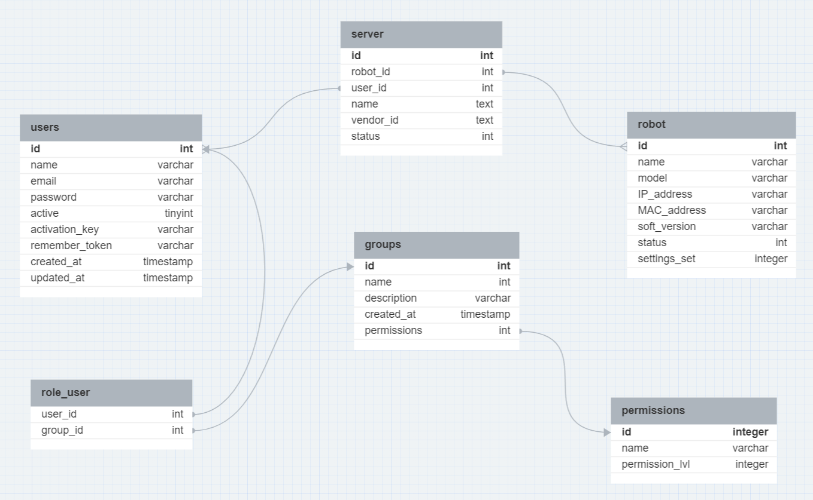