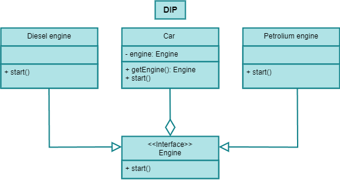
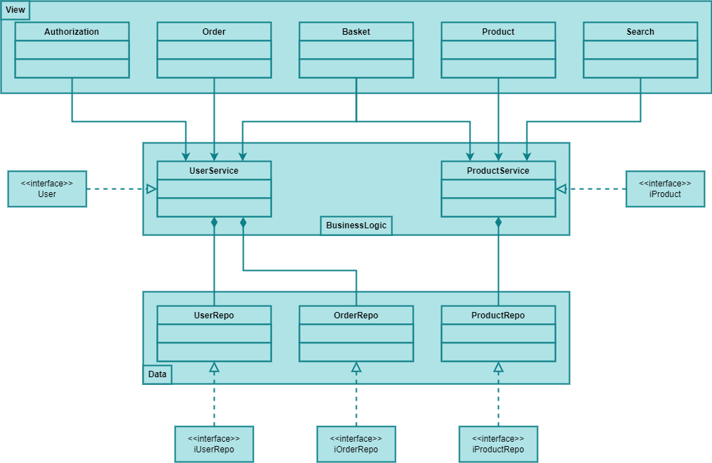

## Задание 1
На основе диаграммы написать классы и конструкторы, без реализации методов.

## Задание 3
С помощью UML диаграммы описать классы приложения.

___

___

___

___

## Задание 4

## Задание 5

## Задание 6

## Задание 10

